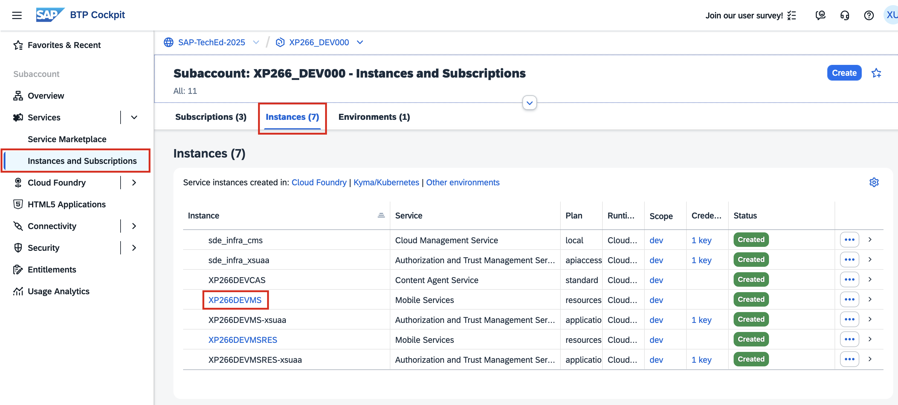
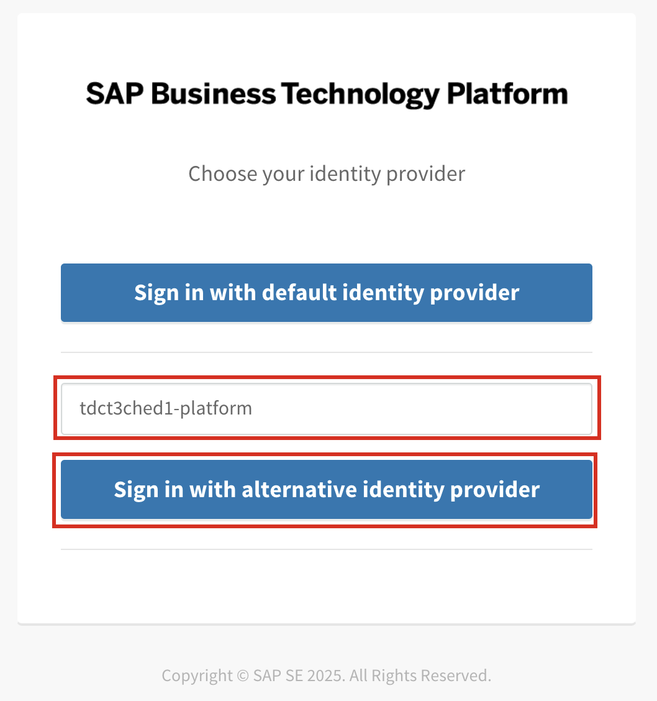
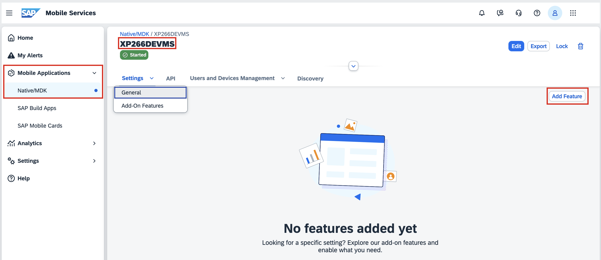
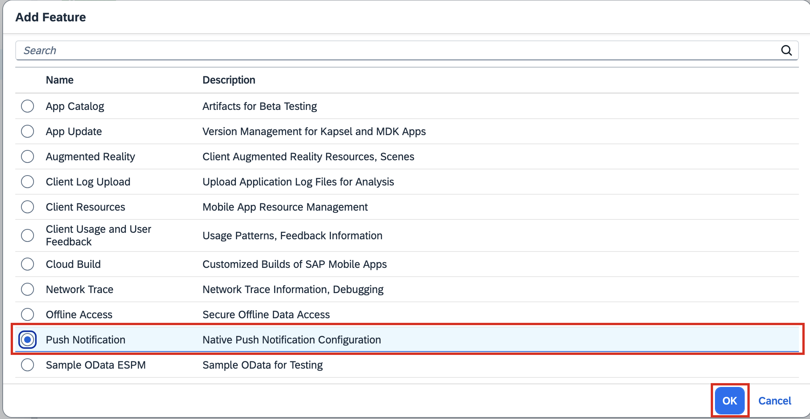
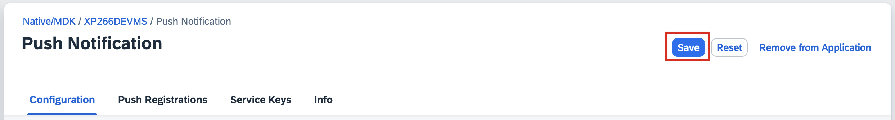
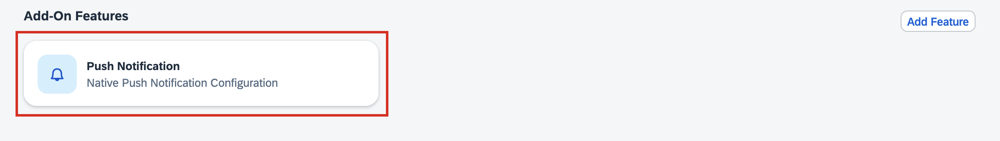
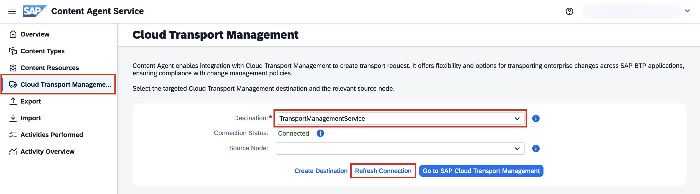

# Transport your low-code application

In this exercise, you will create a new transport request using **SAP Content Agent Service** and **SAP Mobile Services**.

## Exercise 4.0 - Optional: Access Mobile Services and add a new Feature

1. In SAP BTP cockpit, navigate to your development SAP BTP subaccount named `XP266_DEV`.
2. Go to **Services** > **Instances and Subscription**. In the **Instances** area, you will find 2 running instances of **SAP Mobile Services**. Click on the one named ``XP266DEVMS``.
         
3. If prompted with a **Sign-in Screen**, make sure you log in with the correct entity provider. Enter ``tdct3ched1-platform`` as the origin key of your identity provider and continue to sign in.
 

4. In the Mobile Services Cockpit you will find an already running Mobile Services Sample application ``XP266DEVMS``. Add a simple change to this application in next step.
On the bottom right, click on **Add Feature**. 
 
1. In the popup choose any feature from the list e.g. ``Push Notifications`` and confirm with **OK**.
 
1. **Save** the feature. 
 
1. The new feature will appear as a new **Add-On Features** tile in the application.
 

In the next step, you will bundle this application in a new transport request using **SAP Content Agent Service** UI.

## Exercise 4.1 - Setup SAP Content Agent Service

1. In SAP BTP cockpit, navigate to your development SAP BTP subaccount named `XP266_DEV`.
2. Go to **Services** > **Instances and Subscription** and open **Content Agent Service** in the Subscriptions area to access the UI.
         
3. Once Content Agent Service Overview page open, navigate to **Cloud Transport Management** in the side panel.
4. In the drop-down, choose **TransportManagementService** as Destination and click **Refresh Connection**. The status should be **Connected**.
 

## Exercise 4.3 - Create and send a Transport Request in SAP Content Agent Service UI

In SAP Content Agent Service, you will now prepare a transport request containing development content provided by the SAP Mobile Services SDK.

1. In SAP Content Agent Service UI, go to **Export**.
         
2. Tick XP266DEVMS and XP266DEVMSRES of Type Mobile application.
         
3. Go to **Step 2**
4. As Export Mode leave SAP Cloud Transport Management
5. Choose ``DEV`` as your Source Node.
6. Enter a description e.g. ``My low-code application``
7. Continue with **Step 3** and  **Step 4** to trigger **export** to SAP Cloud Transport Management Service.
         

## Summary

You've now created a transport request via SAP Content Agent Service by bundling low-code development content provided by SAP Mobile Services.

In the next exercise you will verify the creation for two transport requests. One that has been created in this exercise 3 and one that has been created in the previous exercise 4.

Continue to - [Verify all Release Steps](../ex5/README.md)
